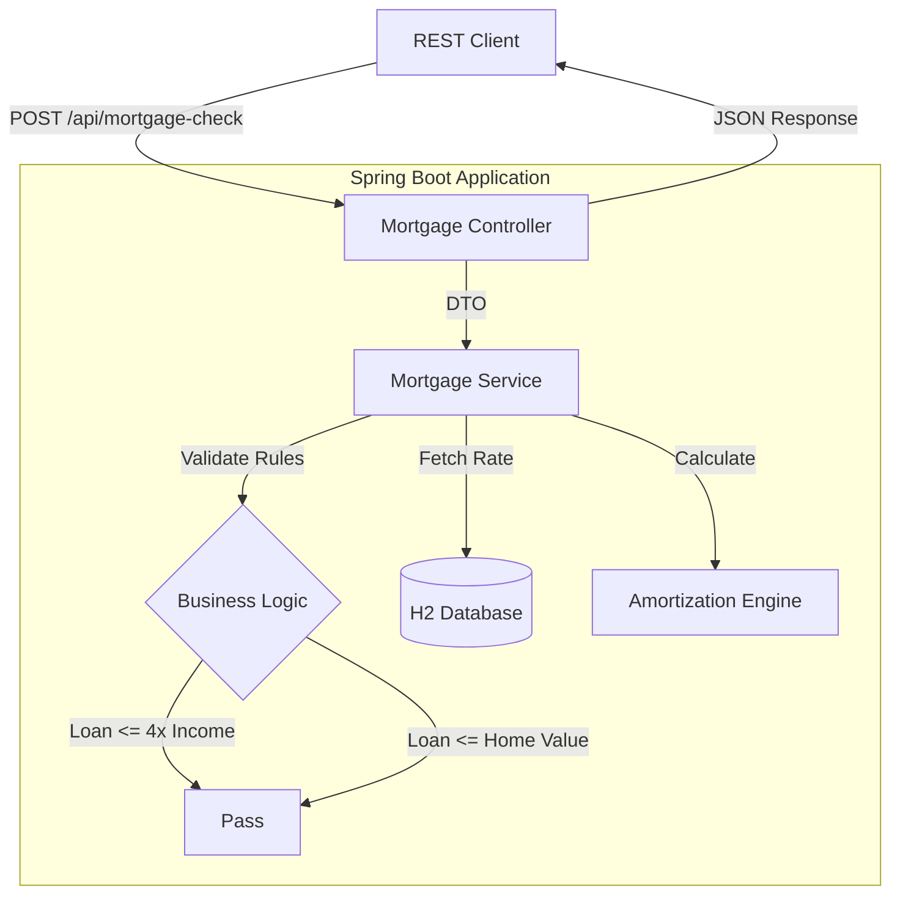
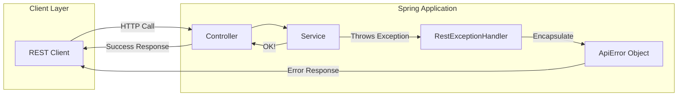

# Mortgage Check API (Spring Boot 4.0.3 MVP)

This is a production-ready microservice built with **Java 21** and **Spring Boot 4.0.3**. It evaluates mortgage feasibility and calculates monthly amortized costs with high financial precision, adhering to specific lending business rules.

---

## 🚀 Quick Start

### 1. Docker (Recommended)
The application is fully containerized for a portable, repeatable runtime environment.
```bash
docker-compose up --build

```

### 2. Maven Command Line

```bash
mvn spring-boot:run

```

### 3. IDE Execution

Run `MortgageApplication.java` directly. Ensure your project SDK is set to **Java 21**.

> **💡 Connectivity Note:** If you encounter issues connecting to `localhost` (common with Docker on macOS), use `http://127.0.0.1:8080` instead. This helps bypass potential IPv6 resolution conflicts and Docker host networking quirks on modern development machines.

---

## 📋 Assignment Overview

This application fulfills the following requirements:

* **Endpoints**:
* `GET /api/interest-rates`: Retrieves current rates created in memory at startup.
* `POST /api/mortgage-check`: Evaluates parameters to calculate feasibility and monthly costs.


* **Business Rules Applied**:
* A mortgage must not exceed **4x the annual income**.
* A mortgage must not exceed the **home value**.


* **Data Model**: Captures `maturityPeriod`, `interestRate` (Percentage), and `lastUpdate` (Timestamp).

---

## 🏗 Architectural Decisions

### 📐 Financial Standards
* **Amortization**: Implemented the standard fixed-rate mortgage formula to derive monthly costs. The calculation is based on the universal annuity equation (Reference: [Wikipedia - Amortization Calculator](https://en.wikipedia.org/wiki/Amortization_calculator)):
* **Domain Assumption (Fixed-Rate Term)**: The amortization engine calculates the monthly cost assuming the interest rate remains fixed for the entire maturity period. It acts as a baseline projection and does not currently model hybrid/dynamic periods (e.g., a 30-year Dutch mortgage with a 10-year *fixed interest period*).
$$M = P \frac{r(1+r)^n}{(1+r)^n - 1}$$

* **$M$**: Total monthly payment
* **$P$**: Principal loan amount
* **$r$**: Monthly interest rate (annual rate / 12)
* **$n$**: Total number of payments (months)

* **Precision**: Used `BigDecimal` for all currency and percentage fields to ensure compliance with financial rounding standards (HALF_UP).
* **Edge Cases**: Logic includes safeguards for 0% interest scenarios (returning $P / n$) to prevent division-by-zero errors.

### 🛠 Technical Pillars

* **Persistence** — H2 in-memory database managed via **Liquibase**. This ensures the schema and seed data are version-controlled and consistent across environments.
* **Observability** — Implemented **Spring AOP** for global logging. Controller entries and exits are automatically traced with execution time (ms) and arguments.
* **Error Handling** — Centralized via `@RestControllerAdvice` to ensure all business and validation exceptions return a standardized JSON structure.
* **Security** — The Docker container runs under a dedicated non-root `mortgage` user for enhanced security.

---

## 📊 System Diagrams

### Request & Logic Flow



### Global Exception Handling Flow



---

## 📑 API Documentation & Testing

**Interactive Swagger UI**: `http://127.0.0.1:8080/swagger-ui/index.html`

OpenAPI specification is available at:
* `http://127.0.0.1:8080/v3/api-docs` (JSON)
* `http://127.0.0.1:8080/v3/api-docs.yaml` (YAML)

Pre-configured test collections are available in the project root:
* `Mortgage API-Postman.json`
* `Mortgage API-Bruno.yml`

---

## 🚫 Not Implemented & Path to Production (Future Enhancements)

While this MVP is robust, preparing this microservice for a true high-traffic production environment would require a few infrastructure additions. The following features are not included in this MVP, but are recommended for production:

* **CI/CD Pipeline** — No automated continuous integration or deployment pipeline is provided. The project is ready for pipeline integration (e.g., GitHub Actions, GitLab CI), but this is not included in the repository.
* **Authentication & Authorization** — No authentication or authorization is implemented. All endpoints are open for demonstration purposes. For production use, consider adding API key, OAuth2, or other security mechanisms.
* **Dedicated Liquibase User & Connection** — The project does not implement a separate database user or connection for Liquibase migrations. In production, it is recommended to use a dedicated user and connection for schema changes to improve security and auditability.
* **Log Streaming & Custom Logback Configuration** — The project does not implement log streaming or custom logback.xml configuration. For production, consider integrating centralized log management (e.g., ELK, Loki, or cloud logging) and custom logback settings.
* **Tracing & Distributed Tracing** — The project does not implement tracing or distributed tracing (e.g., OpenTelemetry, Zipkin, Jaeger). For production, consider integrating tracing for request correlation and observability.
* **API Gateway Integration** — Offload Rate Limiting and JWT validation to an API Gateway (e.g., Kong, Apigee) to protect the controller from DDOS or abuse.
* **Resilience4j** — If the `InterestRateService` is ever refactored to fetch rates from an external banking API rather than a local database, implement Resilience4j `CircuitBreaker` and `Retry` patterns to prevent cascading failures.
* **Caching** — Implement Redis or Spring `@Cacheable` on the `/api/interest-rates` endpoint, as these rates change infrequently but are read constantly.

---

